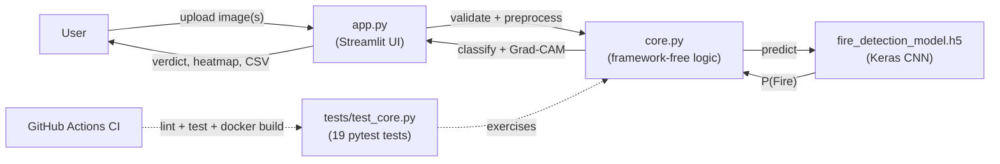

# 🔥 Fire Detection from Satellite Images

**A tested, containerized Streamlit app that classifies satellite/aerial imagery as Fire or No Fire — and explains *why*.**

A Keras CNN drives the prediction; Grad-CAM explainability, a tunable decision threshold, batch CSV triage, and hardened input validation turn a simple classifier demo into a small, production-shaped computer vision tool.

[](https://github.com/bharat3645/fire_detection/actions/workflows/ci.yml)
[](LICENSE)
[](https://www.python.org/)
[](https://streamlit.io)
[](https://www.tensorflow.org/)

---

## Overview

Upload a satellite or aerial image and the app predicts whether it shows fire, using a pretrained Keras CNN. Beyond the base classifier, this project focuses on the things that separate a weekend demo from something you'd actually trust:

- **Explainability** — a real gradient-based Grad-CAM heatmap shows which pixels drove the call, instead of a bare probability.
- **Usability at scale** — batch-upload a folder of images and export a CSV report in one pass.
- **Robustness** — corrupt files, oversized uploads, and model-load failures fail safely with a clear message, never a crash or a silent wrong answer.
- **Engineering hygiene** — the inference/validation logic lives in a framework-free module with a real test suite, linting, CI, and a Dockerfile, not just a single UI script.

## Features

| Feature | Description |
|---|---|
| 🖼️ **Single image detection** | Upload one image and get a Fire / No Fire verdict with a confidence score. |
| 🔬 **Grad-CAM explainability** | A gradient-based heatmap (computed from the model's own convolutional layers, verified against the shipped `fire_detection_model.h5`) overlaid on the image, showing exactly which regions pushed the prediction toward "Fire." |
| 🎚️ **Adjustable decision threshold** | A sidebar slider controls the P(Fire) cutoff (default 0.5) live, useful for demonstrating sensitivity vs. false-positive tradeoffs instead of a hardcoded cutoff. |
| 📦 **Batch upload mode** | Upload many images at once and get a results table — filename, prediction, confidence, P(Fire), and per-file error — exportable as CSV for triaging a whole folder of tiles. |
| 🛡️ **Input validation & safe failure** | Empty files, oversized uploads (10 MB cap), corrupt/non-image files, and model-load failures at startup are all caught and surfaced as clear messages; one bad file in a batch never kills the run. |
| ✅ **Test suite + CI + Docker** | 19 pytest tests (validation, preprocessing, classification, and an end-to-end Grad-CAM test against the real `.h5` model), a ruff lint pass, and a GitHub Actions workflow that runs both plus a Docker build on every push/PR. |

## Tech stack

- **Model / inference:** TensorFlow / Keras (CNN, 64×64 RGB input, single sigmoid output)
- **UI:** Streamlit
- **Image handling:** Pillow, NumPy
- **Testing:** pytest
- **Linting:** ruff
- **CI/CD:** GitHub Actions
- **Containerization:** Docker

## Architecture

The app is split into a framework-free logic layer and a thin UI layer, so prediction, validation, and explainability can be unit-tested without booting Streamlit:



### Project structure

```
fire_detection/
├── app.py                      # Streamlit UI: upload, single/batch inference, results display
├── core.py                     # Framework-free logic: validation, preprocessing, classification, Grad-CAM
├── fire_detection_model.h5     # Pretrained Keras CNN (64x64 RGB input, sigmoid output)
├── tests/
│   └── test_core.py            # 19 pytest tests, incl. an end-to-end test against the real model
├── .github/workflows/ci.yml    # Lint + test + Docker build on every push/PR
├── Dockerfile                  # Container build for one-command deployment
├── .dockerignore
├── pyproject.toml              # ruff + pytest configuration
├── requirements.txt            # Runtime dependencies
├── requirements-dev.txt        # + pytest, ruff
└── README.md
```

## Getting started

### Prerequisites

- Python 3.11+
- (Optional) Docker, for containerized runs

### Installation

```bash
git clone https://github.com/bharat3645/fire_detection.git
cd fire_detection
pip install -r requirements.txt
```

### Run

```bash
streamlit run app.py
```

Open the local URL Streamlit prints (defaults to `http://localhost:8501`).

- **Single Image mode:** upload a satellite image and click **Detect Fire** to see the verdict, confidence, and Grad-CAM heatmap.
- **Batch Upload mode:** upload multiple images, run them all, review the results table, and download it as CSV.

Use the sidebar to adjust the **Fire decision threshold** and toggle the **Grad-CAM heatmap** on or off.

### Run with Docker

```bash
docker build -t fire-detection .
docker run -p 8501:8501 fire-detection
```

## Testing

```bash
pip install -r requirements-dev.txt
pytest -v            # unit tests for core.py, incl. an end-to-end test against the real model
ruff check .          # lint
```

Tests run automatically on every push/PR via GitHub Actions (`.github/workflows/ci.yml`), which also builds the Docker image to catch container regressions.

## Notes / limitations

- The model expects 64×64 RGB input, matching its saved input shape; images are resized automatically before inference.
- The model ships pretrained in this repo — no training script or dataset is included, so it can't be retrained or fine-tuned from this repo alone.
- Prediction quality depends entirely on the (unknown) training dataset used to produce `fire_detection_model.h5`; treat outputs as a demo, not a production wildfire-detection system.
- Grad-CAM is computed on the fly per image and is best-effort — if it fails for a given image, the app still shows the prediction and just skips the heatmap.
- Max upload size is 10 MB per image (configurable via `core.MAX_UPLOAD_SIZE_MB`), to keep the app responsive.

## Roadmap

- [ ] Training/fine-tuning script with a documented dataset
- [ ] Multi-class severity levels (e.g. smoke-only vs. active fire)
- [ ] REST API endpoint alongside the Streamlit UI

## Contributing

Issues and pull requests are welcome. Please run `ruff check .` and `pytest -v` before submitting a PR — both are enforced in CI.

## License

Licensed under the [MIT License](LICENSE) © 2026 [bharat3645](https://github.com/bharat3645).
